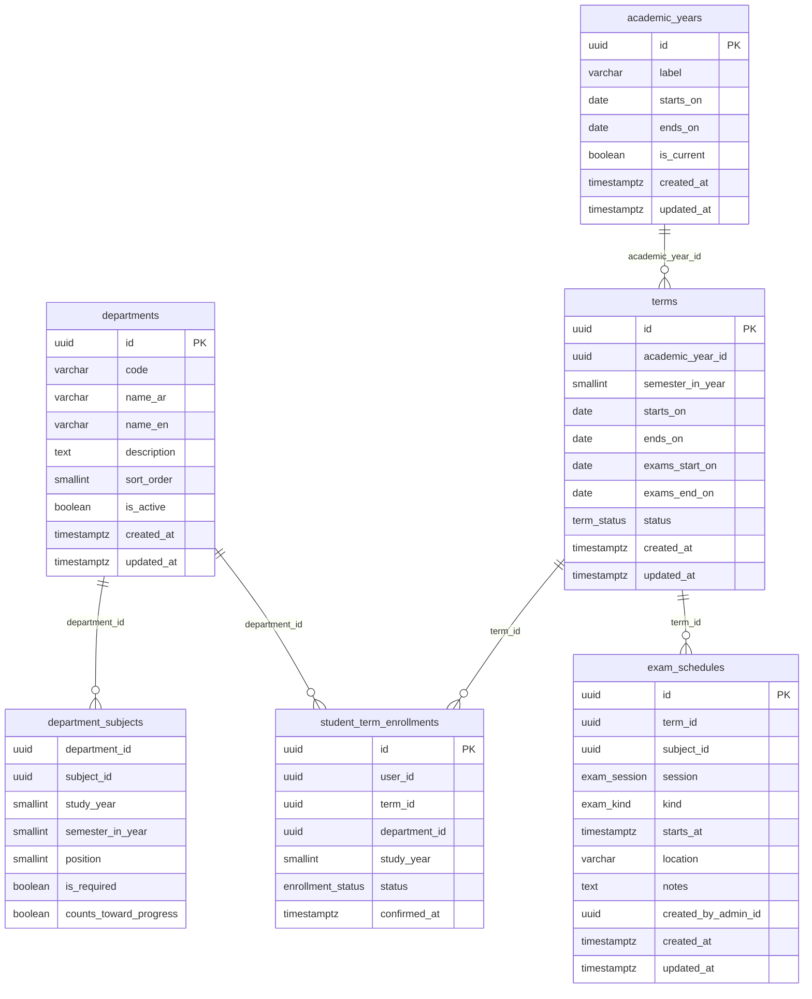

# ERD — B-academic

```mermaid
erDiagram
  academic_years {
    uuid id PK
    varchar label
    date starts_on
    date ends_on
    boolean is_current
    timestamptz created_at
    timestamptz updated_at
  }
  department_subjects {
    uuid department_id
    uuid subject_id
    smallint study_year
    smallint semester_in_year
    smallint position
    boolean is_required
    boolean counts_toward_progress
  }
  departments {
    uuid id PK
    varchar code
    varchar name_ar
    varchar name_en
    text description
    smallint sort_order
    boolean is_active
    timestamptz created_at
    timestamptz updated_at
  }
  exam_schedules {
    uuid id PK
    uuid term_id
    uuid subject_id
    exam_session session
    exam_kind kind
    timestamptz starts_at
    varchar location
    text notes
    uuid created_by_admin_id
    timestamptz created_at
    timestamptz updated_at
  }
  student_term_enrollments {
    uuid id PK
    uuid user_id
    uuid term_id
    uuid department_id
    smallint study_year
    enrollment_status status
    timestamptz confirmed_at
  }
  terms {
    uuid id PK
    uuid academic_year_id
    smallint semester_in_year
    date starts_on
    date ends_on
    date exams_start_on
    date exams_end_on
    term_status status
    timestamptz created_at
    timestamptz updated_at
  }
  academic_years ||--o{ terms : "academic_year_id"
  terms ||--o{ student_term_enrollments : "term_id"
  departments ||--o{ student_term_enrollments : "department_id"
  departments ||--o{ department_subjects : "department_id"
  terms ||--o{ exam_schedules : "term_id"
```
