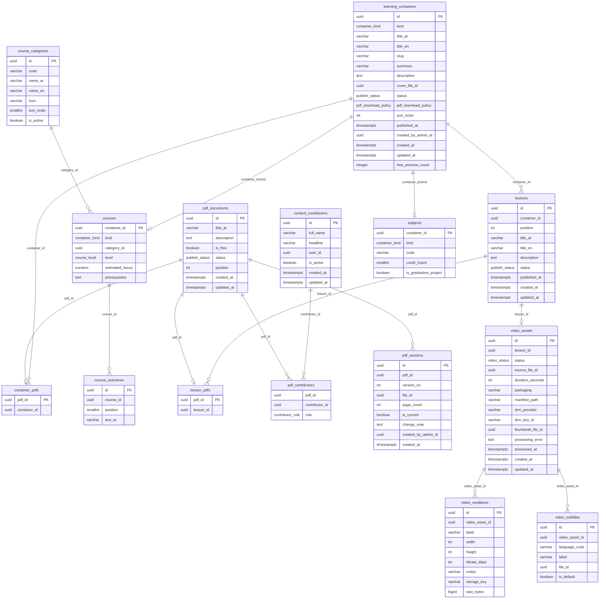

# ERD — C-content

```mermaid
erDiagram
  container_pdfs {
    uuid pdf_id PK
    uuid container_id
  }
  content_contributors {
    uuid id PK
    varchar full_name
    varchar headline
    uuid user_id
    boolean is_active
    timestamptz created_at
    timestamptz updated_at
  }
  course_categories {
    uuid id PK
    varchar code
    varchar name_ar
    varchar name_en
    varchar icon
    smallint sort_order
    boolean is_active
  }
  course_outcomes {
    uuid id PK
    uuid course_id
    smallint position
    varchar text_ar
  }
  courses {
    uuid container_id PK
    container_kind kind
    uuid category_id
    course_level level
    numeric estimated_hours
    text prerequisites
  }
  learning_containers {
    uuid id PK
    container_kind kind
    varchar title_ar
    varchar title_en
    varchar slug
    varchar summary
    text description
    uuid cover_file_id
    publish_status status
    pdf_download_policy pdf_download_policy
    int sort_order
    timestamptz published_at
    uuid created_by_admin_id
    timestamptz created_at
    timestamptz updated_at
    integer free_preview_count
  }
  lesson_pdfs {
    uuid pdf_id PK
    uuid lesson_id
  }
  lessons {
    uuid id PK
    uuid container_id
    int position
    varchar title_ar
    varchar title_en
    text description
    publish_status status
    timestamptz published_at
    timestamptz created_at
    timestamptz updated_at
  }
  pdf_contributors {
    uuid pdf_id
    uuid contributor_id
    contributor_role role
  }
  pdf_documents {
    uuid id PK
    varchar title_ar
    text description
    boolean is_free
    publish_status status
    int position
    timestamptz created_at
    timestamptz updated_at
  }
  pdf_versions {
    uuid id PK
    uuid pdf_id
    int version_no
    uuid file_id
    int page_count
    boolean is_current
    text change_note
    uuid created_by_admin_id
    timestamptz created_at
  }
  subjects {
    uuid container_id PK
    container_kind kind
    varchar code
    smallint credit_hours
    boolean is_graduation_project
  }
  video_assets {
    uuid id PK
    uuid lesson_id
    video_status status
    uuid source_file_id
    int duration_seconds
    varchar packaging
    varchar manifest_path
    varchar drm_provider
    varchar drm_key_id
    uuid thumbnail_file_id
    text processing_error
    timestamptz processed_at
    timestamptz created_at
    timestamptz updated_at
  }
  video_renditions {
    uuid id PK
    uuid video_asset_id
    varchar label
    int width
    int height
    int bitrate_kbps
    varchar codec
    varchar storage_key
    bigint size_bytes
  }
  video_subtitles {
    uuid id PK
    uuid video_asset_id
    varchar language_code
    varchar label
    uuid file_id
    boolean is_default
  }
  learning_containers ||--o| subjects : "container_id,kind"
  course_categories ||--o{ courses : "category_id"
  learning_containers ||--o| courses : "container_id,kind"
  courses ||--o{ course_outcomes : "course_id"
  learning_containers ||--o{ lessons : "container_id"
  lessons ||--o| video_assets : "lesson_id"
  video_assets ||--o{ video_renditions : "video_asset_id"
  video_assets ||--o{ video_subtitles : "video_asset_id"
  pdf_documents ||--o{ pdf_versions : "pdf_id"
  pdf_documents ||--o| container_pdfs : "pdf_id"
  learning_containers ||--o{ container_pdfs : "container_id"
  pdf_documents ||--o| lesson_pdfs : "pdf_id"
  lessons ||--o{ lesson_pdfs : "lesson_id"
  pdf_documents ||--o{ pdf_contributors : "pdf_id"
  content_contributors ||--o{ pdf_contributors : "contributor_id"
```
