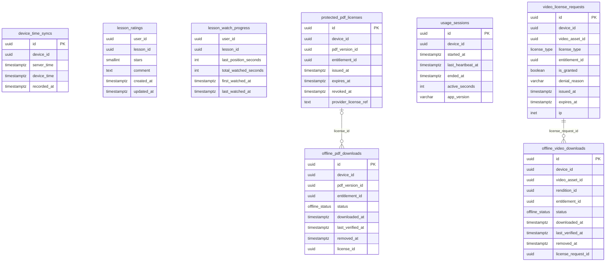

# ERD — E-offline

```mermaid
erDiagram
  device_time_syncs {
    uuid id PK
    uuid device_id
    timestamptz server_time
    timestamptz device_time
    timestamptz recorded_at
  }
  lesson_ratings {
    uuid user_id
    uuid lesson_id
    smallint stars
    text comment
    timestamptz created_at
    timestamptz updated_at
  }
  lesson_watch_progress {
    uuid user_id
    uuid lesson_id
    int last_position_seconds
    int total_watched_seconds
    timestamptz first_watched_at
    timestamptz last_watched_at
  }
  offline_pdf_downloads {
    uuid id PK
    uuid device_id
    uuid pdf_version_id
    uuid entitlement_id
    offline_status status
    timestamptz downloaded_at
    timestamptz last_verified_at
    timestamptz removed_at
    uuid license_id
  }
  offline_video_downloads {
    uuid id PK
    uuid device_id
    uuid video_asset_id
    uuid rendition_id
    uuid entitlement_id
    offline_status status
    timestamptz downloaded_at
    timestamptz last_verified_at
    timestamptz removed_at
    uuid license_request_id
  }
  protected_pdf_licenses {
    uuid id PK
    uuid device_id
    uuid pdf_version_id
    uuid entitlement_id
    timestamptz issued_at
    timestamptz expires_at
    timestamptz revoked_at
    text provider_license_ref
  }
  usage_sessions {
    uuid id PK
    uuid device_id
    timestamptz started_at
    timestamptz last_heartbeat_at
    timestamptz ended_at
    int active_seconds
    varchar app_version
  }
  video_license_requests {
    uuid id PK
    uuid device_id
    uuid video_asset_id
    license_type license_type
    uuid entitlement_id
    boolean is_granted
    varchar denial_reason
    timestamptz issued_at
    timestamptz expires_at
    inet ip
  }
  video_license_requests ||--o{ offline_video_downloads : "license_request_id"
  protected_pdf_licenses |o--o{ offline_pdf_downloads : "license_id"
```
