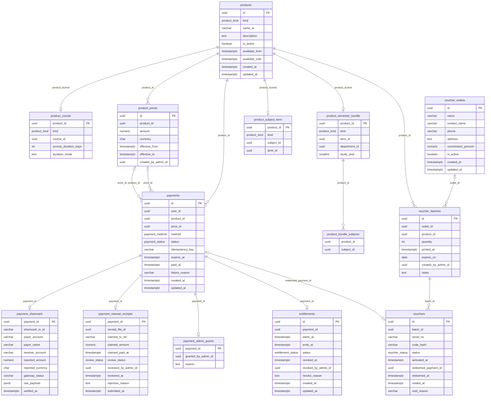

# ERD — F-commerce

```mermaid
erDiagram
  entitlements {
    uuid id PK
    uuid payment_id
    timestamptz starts_at
    timestamptz ends_at
    entitlement_status status
    timestamptz revoked_at
    uuid revoked_by_admin_id
    text revoke_reason
    timestamptz created_at
    timestamptz updated_at
  }
  payment_admin_grants {
    uuid payment_id PK
    uuid granted_by_admin_id
    text reason
  }
  payment_manual_receipts {
    uuid payment_id PK
    uuid receipt_file_id
    varchar claimed_tx_ref
    numeric claimed_amount
    timestamptz claimed_paid_at
    review_status review_status
    uuid reviewed_by_admin_id
    timestamptz reviewed_at
    text rejection_reason
    timestamptz submitted_at
  }
  payment_shamcash {
    uuid payment_id PK
    varchar shamcash_tx_id
    varchar payer_account
    varchar payer_name
    varchar receiver_account
    numeric reported_amount
    char reported_currency
    varchar gateway_status
    jsonb raw_payload
    timestamptz verified_at
  }
  payments {
    uuid id PK
    uuid user_id
    uuid product_id
    uuid price_id
    payment_method method
    payment_status status
    varchar idempotency_key
    timestamptz expires_at
    timestamptz paid_at
    varchar failure_reason
    timestamptz created_at
    timestamptz updated_at
  }
  product_bundle_subjects {
    uuid product_id
    uuid subject_id
  }
  product_course {
    uuid product_id PK
    product_kind kind
    uuid course_id
    int access_duration_days
    text duration_mode
  }
  product_prices {
    uuid id PK
    uuid product_id
    numeric amount
    char currency
    timestamptz effective_from
    timestamptz effective_to
    uuid created_by_admin_id
  }
  product_semester_bundle {
    uuid product_id PK
    product_kind kind
    uuid term_id
    uuid department_id
    smallint study_year
  }
  product_subject_term {
    uuid product_id PK
    product_kind kind
    uuid subject_id
    uuid term_id
  }
  products {
    uuid id PK
    product_kind kind
    varchar name_ar
    text description
    boolean is_active
    timestamptz available_from
    timestamptz available_until
    timestamptz created_at
    timestamptz updated_at
  }
  voucher_batches {
    uuid id PK
    uuid outlet_id
    uuid product_id
    int quantity
    timestamptz printed_at
    date expires_on
    uuid created_by_admin_id
    text notes
  }
  voucher_outlets {
    uuid id PK
    varchar name
    varchar contact_name
    varchar phone
    text address
    numeric commission_percent
    boolean is_active
    timestamptz created_at
    timestamptz updated_at
  }
  vouchers {
    uuid id PK
    uuid batch_id
    varchar serial_no
    varchar code_hash
    voucher_status status
    timestamptz activated_at
    uuid redeemed_payment_id
    timestamptz redeemed_at
    timestamptz voided_at
    varchar void_reason
  }
  product_semester_bundle ||--o{ product_bundle_subjects : "product_id"
  products ||--o{ product_prices : "product_id"
  products ||--o| product_subject_term : "product_id,kind"
  products ||--o| product_semester_bundle : "product_id,kind"
  products ||--o| product_course : "product_id,kind"
  products ||--o{ payments : "product_id"
  product_prices |o--o{ payments : "price_id"
  payments ||--o| payment_shamcash : "payment_id"
  payments ||--o| payment_manual_receipts : "payment_id"
  payments ||--o| payment_admin_grants : "payment_id"
  voucher_outlets |o--o{ voucher_batches : "outlet_id"
  products ||--o{ voucher_batches : "product_id"
  voucher_batches ||--o{ vouchers : "batch_id"
  payments |o--o| vouchers : "redeemed_payment_id"
  payments ||--o| entitlements : "payment_id"
  product_prices |o--o{ payments : "price_id, product_id"
```
