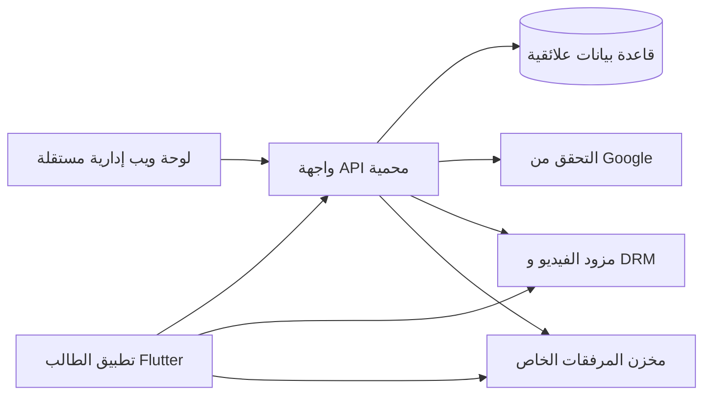

# 02 — المعمارية وحدود المسؤولية

## صورة النظام المقترحة



اعتمدت لوحة ويب منفصلة متجاوبة في 2026-10-08. تطبيق الطالب Flutter، وخادم API خاص؛ تقنية الويب ولغة الخادم والاستضافة وقاعدة البيانات تحتاج اعتماداً. المنصة واحدة لمعهد حلب، دون multi-tenancy.

## إعادة استعمال القدرات

فصل الهوية وDRM والمشغل والتنزيل والتخزين والشبكة خلف عقود ضيقة، مع adapters للمنصة والمزود وحقن اعتماديات. لا تحمل الحزمة المشتركة أسماء المعهد أو المنهج أو منطق الرسوب والدفع الخاص. استخراج حزمة مستقلة عند حاجة فعلية واختبارات توافق؛ لا إعادة هيكلة الكود الحالي لمجرد التعميـم. تبقى أسرار التراخيص ومفاتيح المزود في الخادم، وإعادة الاستعمال لا تعني تشفيراً ثابتاً مشتركاً.

## حدود الخدمات الجديدة

- جلسة الطالب ثم ملف أكاديمي لتوصيات الفصل، وكتالوج كامل المنشور بمرشحات حرة. PDF والفيديو الأول مجانيان بعد الدخول؛ التشغيل المدفوع يفحص الاستحقاق لا قسم الحساب.
- تطبيق ويب مستقل للإدارة يستخدم API الإداري والدور الموثوق؛ حماية جلسة الويب وCSRF/CORS تحدد حسب التقنية ولا ينقل عميل Google للهاتف تلقائياً للويب.
- خدمة دفع وباقات وتقويم تولد استحقاقات بمعاملات؛ لا تثق بـQR أو إيصال عميل دون تحقق ومراجعة.
- عامل OCR يحول صورة خاصة إلى مسودة صفوف؛ خدمة اعتماد علامات منفصلة تطابق وتتحقق وتنشر. الطالب لا يصل للصورة الجماعية.
- خدمة Gemini خلف الخادم بحدود تكلفة ووقت واستجابة منظمة؛ لا تنفذ كود الطالب ولا تخلط نتيجة LLM بعلامة رسمية.
- إعلانات وإشعارات ودعم وتقييمات وتقارير وقت لها كيانات ودورات حياة مستقلة؛ لا Cubit شامل.

## المبادئ الملزمة

- **الخادم مصدر الحقيقة:** يخزن المنهج، النشر، الدور، ربط الجهاز، الاستحقاق، توصيات المسار، العلامات المعتمدة، حالة الوسائط، وسجل التدقيق. لا يعتمد على Flutter في أي قرار مالي أو أمني.
- **طبقات واضحة:** `presentation` للواجهة وCubit، `domain` للكيانات وحالات الاستخدام والعقود، `data` لتطبيق العقود والنقل والتخزين. لا تعتمد `domain` على Flutter أو حزمة HTTP.
- **اعتماديات للداخل:** الصفحة تستدعي Cubit؛ Cubit يستدعي use case؛ use case يعتمد على repository contract؛ implementation في data يستدعي API/cache.
- **نماذج API منفصلة عن كيانات المجال:** لا تنشر JSON أو أنواع مزود الفيديو إلى كل الواجهة.
- **حدود حسب الميزة:** auth، curriculum، courses، lessons، playback، downloads، profile، admin. المشترك الحقيقي فقط داخل `core`.
- **تكامل عبر واجهات:** مزود فيديو/DRM، الهوية، التخزين، القياس تُغلّف خلف عقود قابلة للاختبار والتبديل.

## هيكل Flutter عند التنفيذ

```text
lib/
  app/
    app.dart
    router.dart
    composition_root.dart
  core/
    error/
    network/
    security/
    theme/
    widgets/
  features/
    auth/{data,domain,presentation}/
    curriculum/{data,domain,presentation}/
    courses/{data,domain,presentation}/
    lessons/{data,domain,presentation}/
    playback/{data,domain,presentation}/
    downloads/{data,domain,presentation}/
    profile/{data,domain,presentation}/
    admin/{data,domain,presentation}/
```

أنشئ المجلدات حين توجد ميزة فعلية، لا مجلدات فارغة. ضع محرك التشغيل الأصلي خلف جسر محدد المسؤولية؛ لا تجبر فيديو DRM على المرور عبر `video_player` إن لم يدعم المسار المطلوب. افصل حالة تنزيل الأصل عن حالة تشغيله وعن استحقاق الدورة.

## بنية الخادم المقترحة

- API خاص بالعملاء لإرجاع فهارس منشورة، تفويض التشغيل، التفويض للمرفقات، الاستحقاقات، وربط الأجهزة.
- API إداري منفصل منطقياً أو بنطاق `/admin` يتطلب دوراً إدارياً من الخادم، مع سجل تدقيق ومعرّف طلب.
- قاعدة بيانات علائقية ذات قيود فريدة ومراجع خارجية ومعاملات، مناسبة لتكرار موضع المادة وتزامن ربط الجهاز والاستحقاقات.
- خدمة/عامل لمعالجة أحداث رفع الفيديو وتحديث حالته؛ لا تنشر درساً ما دام الفيديو غير جاهز أو إعداد الحماية ناقصاً.
- تخزين خاص للمرفقات مع روابط قصيرة العمر أو تمرير عبر الخادم؛ لا تخزن ملفاً مدفوعاً في حاوية عامة.

اختيار منصة الخادم، قاعدة البيانات المستضافة، مزود Google على الخادم، ومزود الفيديو قرارات في `09-decisions.md`. لا تربط بنية Flutter بخدمة سحابية محددة قبل الحسم.

## عقود الأخطاء والحالة

- أخطاء متوقعة مميزة: لا شبكة، جلسة منتهية، جهاز آخر نشط، لا استحقاق، دورة غير منشورة، أصل قيد المعالجة، رخصة انتهت، مساحة غير كافية، فشل DRM غير مدعوم.
- أخطاء API تحمل رمزاً مستقراً ورسالة آمنة ومعرّف طلب؛ تعرض الواجهة نصاً مناسباً للمستخدم ولا تعرض تفاصيل الخادم.
- إعادة المحاولة للقراءة والطلبات القابلة للإعادة فقط. عمليات النشر ونقل الجهاز والمنح تستخدم مفتاح idempotency/قيود معاملات.
- القوائم تُصفّح وتُخزّن بمدة مناسبة؛ لا تعتمد على تحميل جميع الدروس أو الطلاب دفعة واحدة.

## مبدأ الأداء

ابدأ بقياس وقت فتح التطبيق، عرض القائمة، بدء الفيديو، واستعادة التنزيل قبل تحديد عتبات نهائية. اعرض صوراً مصغرة بحجم مناسب، لا تجلب بيانات الدرس كاملة في قائمة المواد، وألغ الطلبات عند مغادرة الصفحة. راقب استهلاك البيانات ومساحة التخزين في التنزيلات.
